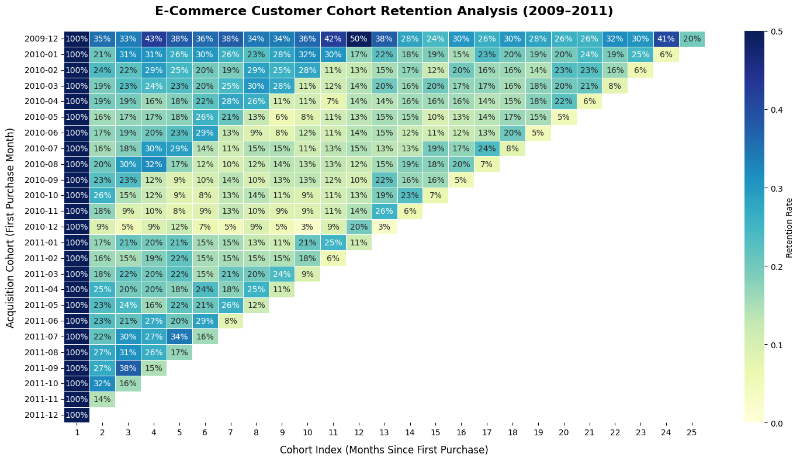

Markdown

# E-Commerce Customer Retention & Cohort Churn Analysis

## Project Objective 
- **Commercial Context:** An enterprise e-commerce retailer experienced declining revenue growth despite aggressive customer acquisition spend.
- **Analytical Goal:** Build a dynamic Python cohort retention engine to find repeat purchase decay over customer lifecycle, proving whether revenue loss was caused by post-acquisition churn rather than top-of-funnel conversion.

## Methodology & Data Engineering
**Hygiene & Filtering:** Processed transactional ledger records ('Online Retail II UCI'), stripping unassigned accounts ('Customer ID is NULL'), cancellations ('Quantity <= 0'), and system adjustments ('Price <= 0').
- **Feature Engineering:** Truncated invoice timestamps into standardized monthly intervals ('InvoiceMonth'). Computed 'CohortMonth' per account via grouped minimum transformations.
- **Index math:** I tracked how customer cohorts behaved over time by measuring the number of months ('CohortIndex') since their first purchase, starting at month 1.
- **Reshaping & Normalization** Grouped by 'CohortMonth' and 'CohortIndex', calculated unique active accounts via 'nunique()', and normalized values against baseline cohort sizes using '.divide(..., axis=0)'.

## Key Insights & Retention Diagnostics
- **The Month 2 Churn Cliff:** Customer retention suffers an immediate, approximately 80% average drop-off between Month 1 and Month 2 across nearly all acquisition classes.
- **One-and-Done Acquisition Trap:** Four out of five newly acquired customers never return to make a second purchase, proving that increased advertising spend is masking a leaky customer retention bucket.
- **Long-Tail Stabilization:** Accounts that survive past month 3 exhibit steady retention plateaus (averaging 15%–20% active engagement through Month 12), indicating strong product-market fit among a dedicated minority.
## Visual Analysis (Cohort Retention Heatmap)

